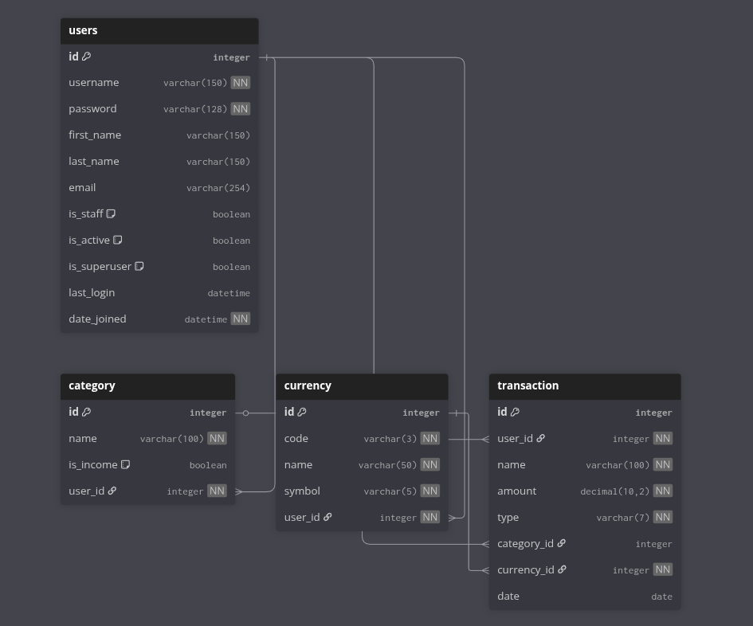

# 💰 Financial Tracker Django

**Financial Tracker** — це веб-додаток для відстеження особистих фінансів.
Користувач може вести облік доходів та витрат, створювати власні категорії, додавати різні валюти та аналізувати свої фінансові звички.

Проєкт реалізовано на базі Django із власною системою користувачів, підтримкою декількох валют та зручною структурою моделей.
---
---

## ⚙️ Основні можливості
💸 Додавання доходів і витрат

🏷️ Створення власних категорій (дохід / витрата)

💱 Підтримка різних валют із символами

👤 Персональні акаунти користувачів

📅 Автоматичне збереження дати транзакції

📊 Просте керування фінансами через Django Admin


---

## 🛠 Технології

- Python 3.10+
- Django 4.x
- Django Admin
- Bootstrap 5
- HTML / CSS / JavaScript
- SQLite *(для розробки)* / PostgreSQL *(для продакшену)*

---

## 🚀 Встановлення

### 🔧 Клонуйте репозиторій:
```bash
   git clone https://github.com/Bohdan11Dii/financial_tracker_django.git 
   cd financial_tracker_django
```
---
## 📦 Створіть та активуйте віртуальне середовище:
```bash
    python -m venv venv
    source venv/bin/activate  # або venv\Scripts\activate на Windows
```
---
## 📅 Встановіть залежності:
```bash
    pip install -r requirements.txt
```
---
## ⚙️ Застосуйте міграції:

```bash
    python manage.py makemigrations
    python manage.py migrate
```
---
## 👤 Створіть суперкористувача:

```bash
    python manage.py createsuperuser
```
---
## ▶️ Запуск сервера:
```bash
    python manage.py runserver
```
---
📍 Проєкт буде доступний за адресою: http://127.0.0.1:8000

## Database schema

